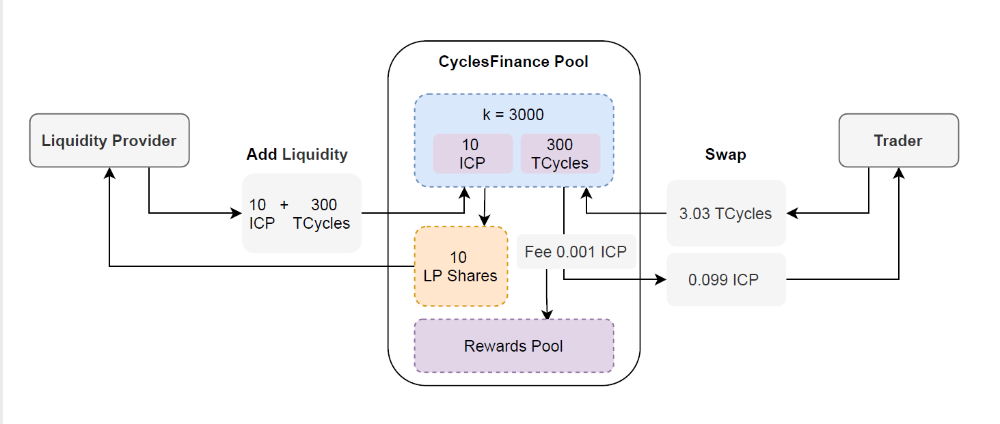

# Cycles.Finance

**Website**: http://cycles.finance  
**Canister Id**: ium3d-eqaaa-aaaak-aab4q-cai   
**Module hash**(14/12): 19ee5e66085230b35fe86284c7144fe8e95b0fb4f08fc50bcb4d0f5b264c4f6d  

### Disclaimers.

This project is in beta and may have defects.  It‘s a Dapp, please be knowledgeable and participate voluntarily at your own risk.

##  Overview

Cycles.Finance is an ICP/Cycles marketplace that supports bidirectional exchange of ICP, Cycles, using a multiplicative constant K model (A*B=K), similar to UniSwapV2.

#### Restrictions on Swapping

The project is still in beta and limits have been placed on a swap in order to control risk. 
- ICP: max 10 icp each swap, min 10,000 e8s each swap.
- Cycles: max 3*10^14 cycles each swap, min 10^8 cycles each swap.
- Swap volatility limit: a swap causing price fluctuations more than 20% will be rejected.
 
#### Swap fees

Swapping fee: 1%, on a post-fee model, charged in ICPs or Cycles.  
ICP transfer fee: 10,000 e8s per transfer, deducted by ic network.  
Swapping fee usage: All ICP charged is moved to the liquidity reward pool, 80% of Cycles charged is moved to the liquidity reward pool (the other 20% is used for Canister gas).

#### Liquidity (AMM)

Market making model: automatic market making model(AMM). Using a multiplicative constant K model (AB=K).     

#### Liquidity reward pool
  
- Liquidity providers receive liquidity rewards in proportion to the time-weighted share they hold.  
- [Plan] Participate in the ICLighthouse liquidity mining program and receive ICL token rewards.


## How does it work?

CyclesFinance is designed to facilitate the swap of ICPs and Cycles in a different way to traditional exchanges.

It does this by using Canister smart contracts, which allow users (called liquidity providers) to deposit ICPs/Cycles into pool. These smart contracts allow traders to buy and sell these assets. Users who trade these assets pay a fee which is then distributed to all liquidity providers proportionally (based on their contribution to the asset pool).



**Liquidity pool**

The liquidity pool holds ICPs and Cycles, which together represent a trading pair for those assets.

CyclesFinance uses a pricing mechanism called the ‘multiplicative constant k market maker model’. The formula (A * B = k) is used to determine the pricing for the pair.   
A and B represent the pool balance of each asset, and k is the total constant price of said pool.   
In the liquidity pool, the first liquidity provider sets the initial price of the assets in the pool by supplying an equal value to both tokens. 

**Swap**

Buyers can then swap ICP/Cycles within the pool, based on the formula. Smart contracts running the rule use the above formula to take the amount of one asset from the buyer and send an equivalent amount of another asset purchased back to the buyer, keeping the total pool constant stable (k).

**Example**: 

Let us imagine the ICP/Cycles liquidity pool contains 10 ICP(A) and 300 TCycles (B), therefore making the pool constant value 3000 (k).   
This implies that the pool’s starting price is 30 TCycles per ICP. 

Now, let us imagine a trader comes in and wants to buy 0.1 ICP. 

The ICP/Cycles pool will now have:

New A: 9.9 ICP (10 - 0.1)   
k: 3000 (stays constant)  
New B: 303.03 TCycles (3000 / 9.9)  
Therefore, the pool would imply a price of 30.303 TCycles per ICP to keep k constant since you had to add 3.03 TCycles (303.03 TCycles – 300 TCycles) to the pool to buy 0.1 ICP.

In the above example, the next implied rate for ICP will be around 30.609 TCycles per ICP (303.03 TCycles/9.9 ICP).

When the price of an asset starts to trade away from market prices, arbitragers see this as an opportunity to make risk-free returns. Therefore, they come in to trade the price back to market rates. This is a vital part of the ICP/Cycles ecosystem.


## Technical features

#### Achieving ultimate consistency

CyclesFinance faces atomicity problems mainly with ICP internal transfer failures and Cycles send failures. We use a Best Effort Commit strategy together with an error handling mechanism to ensure ultimate consistency.

- Before updating state variables, an exception is thrown when an error is encountered.
- It ensures that all internal state variables are successfully saved when some of them have already been updated, and external calls take a Best Effort Commit strategy, but to prevent duplicate transactions, so an error handling mechanism is added.
- With regard to the error handling mechanism, it requires the administrator or governance contract to trigger a retransaction.  For accounts that are unable to receive Cycles, the manager or governance contract can modify the receiving account.

#### Enhanced idempotency

The idempotency prevents repeated executions when an external canister is submitted repeatedly in the event of an error in the call to CyclesFinance. 
- The transaction txid is computable and globally unique.
- The nonce mechanism for accounts is supported (to be supported soon).

#### Oracle quotes support

ICP/Cycles swap prices could be used as native Oracle quotes on the IC network. 
CyclesFinance offers two forms of Oracle quotes, including    
- Latest prices: The liquidity(null) method of the CyclesFinance canister is used to query the number of ICPs and Cycles in the liquidity pool. `cycles/icp.e8s` means the ICP/Cycles price.
- Time-weighted prices: The liquidity(null) method of the CyclesFinance canister is used to query the time-weighted cumulative value of ICPs and Cycles.


#### liquidity mining support

CyclesFinance can provide a data resource for liquidity mining contracts as well as a space for innovation in community governance and economic models.
The liquidity() method of the CyclesFinance canister is used to query the time-weighted cumulative value of the LP's liquidity pool share.


#### Trading mining support

CyclesFinance can provide data resources for trading mining. It can query the cumulative value of trading volume on a global or account basis.

#### Scalable storage of transaction records (to be supported soon)

To ensure that CyclesFinance can support large-scale application scenarios, the CyclesFinance canister stores only recent transactions, which are stored persistently via an external scalable canisters.


## Usage (Command line interface)

**Notes**
- UI interaction interface: http://cycles.finance 
- The basic unit of ICP in canister is e8s, 1 icp = 10^8 e8s;
- The ICP/Cycles rate on IC network changes dynamically and is pegged to the XDR value, 1 XDR = 10^12 cycles (value approx. 1.4 USD).
- The ICP/Cycles rate on this canister is automatically formed by the market and may deviate from other markets.
- Your `ICP account principal` and `Cycles wallet account principal` are used to interact with this canister, please note the difference between them.

### Query ICP/Cycles price
````
dfx canister --network ic call ium3d-eqaaa-aaaak-aab4q-cai liquidity '(null)'
````
The `e8s` (or `5_035_232`) field in the return value is divided by the `cycles` (or `2_190_693_645`) field to indicate how many cycles can be exchanged for 1 e8s. This value is multiplied by 10^8 to indicate how many cycles can be exchanged for 1 icp. this is an estimate.
````
(
  record {
    icp = record { e8s = 787_146_478 : nat64 };
    vol = record {
      swapIcpVol = 1_740_878 : nat;
      swapCyclesVol = 573_069_740_022 : nat;
    };
    shareWeighted = record {
      updateTime = 1_638_592_854 : nat;
      shareTimeWeighted = 3_894_326_391_123 : nat;
    };
    unitValue = record { 329155.999121 : float64; 0.972376 : float64 };
    share = 809_508_285 : nat;
    cycles = 266_454_525_225_963 : nat;
    priceWeighted = record {
      updateTime = 1_638_592_854 : nat;
      icpTimeWeighted = 3_800_565_037_457 : nat;
      cyclesTimeWeighted = 1_277_301_377_584_917_917 : nat;
    };
    swapCount = 0 : nat64;
  },
)
````

### ICP to Cycles

Step1: Get your dedicated ICP deposit account-id (**DepositAccountId**)
````
dfx canister --network ic call ium3d-eqaaa-aaaak-aab4q-cai getAccountId '(principal "<your_icp_account_principal>")'
````
Return `DepositAccountId`(example)
````
("f2d1945ebc293bdc2cc6ef**************e84cf61f51ce6798fc4283") 
````

Step2: Send ICP to `DepositAccountId`
````
dfx ledger --network ic transfer <your_DepositAccountId> --memo 0 --e8s <icp_e8s_amount>
````

Step3: Converting to Cycles. Parameters `icp_e8s_amount` is the amount sent in Step2 and `your_cycles_wallet_principal` is the principal of your cycles wallet (note: not your ICP account principal).
````
dfx canister --network ic call ium3d-eqaaa-aaaak-aab4q-cai icpToCycles '(<icp_e8s_amount>:nat,principal "<your_cycles_wallet_principal>",null)'
````
Check your wallet balance
````
dfx wallet --network ic balance
````

### Cycles to ICP

Step1: Use the didc tool to encode the parameters. Note, didc tool resources: https://github.com/dfinity/candid/tree/master/tools/didc
````
didc encode '(principal "<your_icp_account_principal>",null)' -t '(principal,opt blob)' -f blob
````
Return `CallArgs`(example)
````
blob "DIDL\02n\01m{\02h\00\01\**************\88\01\e1\18\fd6G\02\00"
````

Step2: Converting to ICP. The parameter `cycles_amount` is the amount of cycles you want to convert, and the parameter `call_args` is the `CallArgs` got from Step1. 
````
dfx canister --network ic call <your_cycles_wallet_principal> wallet_call '(record {canister=principal "ium3d-eqaaa-aaaak-aab4q-cai"; method_name="cyclesToIcp"; cycles=<cycles_amount>:nat64; args=<call_args>})'
````
Check your account balance
````
dfx ledger --network ic balance
````

### Add liquidity

To add liquidity, both ICP and Cycles to be added to the liquidity pool, the proportion is calculated based on the current price and the excess will refunded.

Step1: Get your dedicated ICP deposit account-id（**DepositAccountId**）
````
dfx canister --network ic call ium3d-eqaaa-aaaak-aab4q-cai getAccountId '(principal "<your_icp_account_principal>")'
````
Return (example)
````
("f2d1945ebc293bdc2cc6ef**************e84cf61f51ce6798fc4283") 
````

Step2: Send ICP to `DepositAccountId`
````
dfx ledger --network ic transfer <your_DepositAccountId> --memo 0 --e8s <icp_e8s_amount>
````

Step3: Use the didc tool to encode the parameters. Note, didc tool resources: https://github.com/dfinity/candid/tree/master/tools/didc
````
didc encode '(principal "<your_icp_account_principal>",null)' -t '(principal,opt blob)' -f blob
````
Return `CallArgs`(example)
````
blob "DIDL\02n\01m{\02h\00\01\**************\88\01\e1\18\fd6G\02\00"
````

Step4: Send Cycles, add liquidity. The parameter `cycles_amount` is the amount of cycles you want to add, and the parameter `call_args` is the `CallArgs` got from Step3.
````
dfx canister --network ic call <your_cycles_wallet_principal> wallet_call '(record {canister=principal "ium3d-eqaaa-aaaak-aab4q-cai"; method_name="add"; cycles=<cycles_amount>:nat64; args=<call_args>})'
````

Step5: Enquire about liquidity shares
````
dfx canister --network ic call ium3d-eqaaa-aaaak-aab4q-cai liquidity '(opt principal "<your_icp_account_principal>")'
````
Return (example). The `share` (or `2_082_268_383`) field is the share of liquidity you hold.
````
(
  record {
    icp = record { e8s = 48_521_783 : nat64 };
    vol = record {
      swapIcpVol = 1_648_218 : nat;
      swapCyclesVol = 541_650_948_359 : nat;
    };
    shareWeighted = record {
      updateTime = 1_638_528_867 : nat;
      shareTimeWeighted = 695_045_889_662 : nat;
    };
    unitValue = record { 329748.544469 : float64; 0.970629 : float64 };
    share = 49_990_000 : nat;   
    cycles = 16_484_143_085_896 : nat;
    priceWeighted = record {
      updateTime = 1_638_528_867 : nat;
      icpTimeWeighted = 689_683_291_306 : nat;
      cyclesTimeWeighted = 224_229_508_922_468_505 : nat;
    };
    swapCount = 0 : nat64;
  },
)
````

### Remove liquidity

Step1: Query your liquidity share, the `share` (or `2_082_268_383`) field in the return is your share held.

````
dfx canister --network ic call ium3d-eqaaa-aaaak-aab4q-cai liquidity '(opt principal "<your_icp_account_principal>")'
````

Step2: Remove liquidity. The parameter `share_amount` must be equal to or less than the value queried by Step1, and the parameter `your_cycles_wallet_principal` is wallet principal used to receive the cycles, and caller  principal will receive icp.

````
dfx canister --network ic call ium3d-eqaaa-aaaak-aab4q-cai remove '(<share_amount>:nat, principal "<your_cycles_wallet_principal>", null)'
````
Check your account balance
````
dfx ledger --network ic balance
dfx wallet --network ic balance
````

### Claim Rewards

Claim Rewards. The parameter `your_cycles_wallet_principal` is wallet principal used to receive cycles, and caller principal will receive icp.
````
dfx canister --network ic call ium3d-eqaaa-aaaak-aab4q-cai claim '(principal "<your_cycles_wallet_principal>", null)'
````
Check your account balance
````
dfx ledger --network ic balance
dfx wallet --network ic balance
````

## DID

````
type Vol = record {swapCyclesVol: nat; swapIcpVol: nat; };
type TxnResult = record { cycles: TokenValue; icpE8s: TokenValue; share: ShareChange; txid: Txid; };
type TxnRecord = record {
   account: principal;
   cyclesWallet: opt principal;
   data: opt blob;
   fee: record { token0Fee: nat; token1Fee: nat; };
   operation: OperationType;
   share: ShareChange;
   time: Time;
   token0: TokenType;
   token0Value: TokenValue;
   token1: TokenType;
   token1Value: TokenValue;
   txid: Txid;
};
type Txid = blob;
type TokenValue = variant { In: nat; NoChange; Out: nat; };
type TokenType = variant { Cycles; DRC20: principal; Icp; };
type Timestamp = nat;
type Time = int;
type ShareWeighted = record { shareTimeWeighted: nat; updateTime: Timestamp; };
type ShareChange = variant { Burn: nat; Mint: nat; NoChange;};
type PriceWeighted = record { cyclesTimeWeighted: nat;icpTimeWeighted: nat; updateTime: Timestamp;};
type OperationType = variant { AddLiquidity; Claim; RemoveLiquidity; Swap;};
type Liquidity = record {
   cycles: nat;
   icp: ICP;
   priceWeighted: PriceWeighted;
   share: nat;
   shareWeighted: ShareWeighted;
   swapCount: nat64;
   unitValue: record { float64; float64; };
   vol: Vol;
};
type ICP = record {e8s: nat64;};
type FeeStatus = record {
   fee: float64;
   cumulFee: record { cyclesBalance: nat; icpBalance: nat; };
   totalFee: record { cyclesBalance: nat; icpBalance: nat; };
   myAllocable: opt record { cyclesBalance: nat; icpBalance: nat; };
};
type ErrorLog = record {
   time: Timestamp;
   user: principal;
   withdraw: record { principal; nat; principal; nat; };
};
type Config = record {
   CYCLES_LIMIT: opt nat;
   FEE: opt nat;
   ICP_FEE: opt nat64;
   ICP_LIMIT: opt nat;
   MAX_CACHE_NUMBER_PER: opt nat;
   MAX_CACHE_TIME: opt nat;
   MAX_STORAGE_TRIES: opt nat;
   MIN_CYCLES: opt nat;
   MIN_ICP_E8S: opt nat;
   STORAGE_CANISTER: opt text;
};
type CyclesMarket = service {
   getAccountId: (_account: principal) -> (text) query;
   cyclesToIcp: (_account: principal, _data: opt blob) -> (TxnResult);
   icpToCycles: (_icpE8s: nat, _cyclesWallet: principal, _data: opt blob) -> (TxnResult);
   add: (_account: principal, _data: opt blob) -> (TxnResult);
   remove: (_share: opt nat, _cyclesWallet: principal, _data: opt blob) -> (TxnResult);
   claim: (_cyclesWallet: principal, _data: opt blob) -> (TxnResult);
   count: (_account: opt principal) -> (nat) query;
   liquidity: (_account: opt principal) -> (Liquidity) query;
   feeStatus: (_account: opt principal) -> (FeeStatus) query;
   lastTxids: (_account: opt principal) -> (vec Txid) query;
   getEvents: (_account: opt principal) -> (vec TxnRecord) query;
   txnRecord: (_txid: Txid) -> (opt TxnRecord) query;
   getConfig: () -> (Config) query;
};
service : () -> CyclesMarket
````


## Roadmap

(doing) Development of UI interface, open source contract code.

Upgrade to v1.0.

Opening up liquidity mining.


## Community

Web: http://cycles.finance/  

Github: https://github.com/iclighthouse/Cycles.Finance 

Twitter: https://twitter.com/ICLighthouse

Medium: https://medium.com/@ICLighthouse 

Discord: https://discord.gg/FQZFGGq7zv