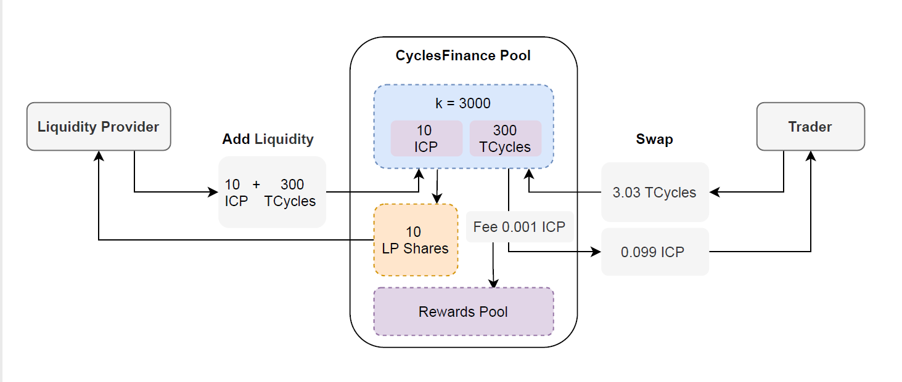
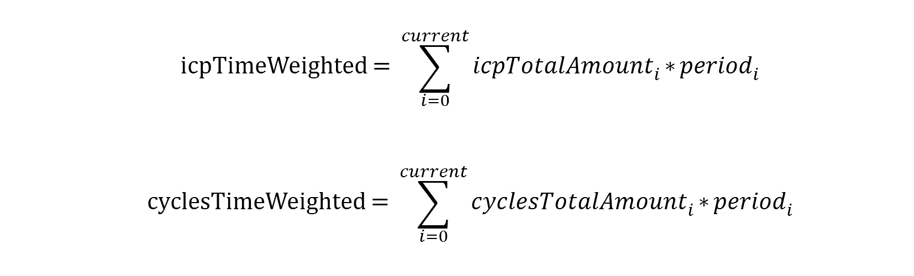

# Cycles.Finance

**Website**: http://cycles.finance  
**Canister Id**: ium3d-eqaaa-aaaak-aab4q-cai   
**Module hash**(14/12): 19ee5e66085230b35fe86284c7144fe8e95b0fb4f08fc50bcb4d0f5b264c4f6d  

### 申明：

项目正处于测试期，可能存在缺陷。这是一个Dapp，请了解相关知识，并自愿参与，自行承担所有风险。

##  概述

Cycles.Finance是一个ICP/Cycles去中心化市场，支持ICP、Cycles的双向兑换，采用乘法恒定K模型（A*B=K），类似UniSwapV2。

#### 交易限制

项目仍然处于测试期，为了控制风险，对单笔交易进行了限额。
- ICP：单笔交易最大10 icp，最小10000 e8s。
- Cycles：最大3*10^14 cycles，最小10^8 cycles。
- 交易波动性限制：单笔交易引起价格波动超过20%会被拒绝。
 
#### 交易费用

交易费：1%，采取后收费模式，收取ICP或者Cycles。  
ICP转账费用: 每笔ICP转账被IC网络收取10000 e8s。  
交易费用途：收取的ICP全部进入流动性奖励池，收取的Cycles的80%进入流动性奖励池（另外20%用于Canister的消耗）。

#### 流动性做市

做市模型：AMM自动做市模型。采用乘法恒定K模型（AB=K）。  
流动性做市收益：  
- 流动性提供者按照持有份额的时间加权比例分配流动性奖励池资产。 
- [计划] 参与ICLighthouse流动性挖矿计划，获得ICL代币奖励。


## 它是如何工作的？

CyclesFinance旨在以不同于传统交易所的方式进行ICP和Cycles的互换。

它通过使用Canister智能合约来做到这一点，允许用户（称为流动性提供者）将ICP和Cycles存入池中。智能合约允许交易者购买和出售这些资产。交易这些资产的用户支付交易费用，该费用按比例分配给所有流动性提供者（基于他们对资产池的贡献）。



**流动性池**

流动性池持有ICP和Cycles，它们组成该资产池的交易对。

CyclesFinance使用一种叫做 "乘法常数k做市商模型 "的定价机制。该公式（A * B = k）用于确定交易对的价格。  
A和B代表两种资产的池子余额，而k是池子的总恒定价格。  
在流动性池中，第一个流动性提供者通过向两个代币提供同等价值来设定池中资产的初始价格。

**交易**

然后，买方可以根据公式，在池内交易ICP/Cycles。运行该规则的智能合约使用上述公式，从买方那里获取一种资产的数量，并将另一种资产的同等数量送回给买方，保持总池的稳定（k）。

**例子**

假设ICP/Cycles流动性池包含10个ICP(A)和300个TCycles(B)，因此池子的恒定值为3000(k)。  
这意味着池子的起始价格是30TCycles每个ICP。

现在，让我们想象一下，一个交易者进来，想买0.1个ICP。

交易后，ICP/Cycles池将有：

新A: 9.9 ICP (10 - 0.1)   
k: 3000 (保持不变)  
新B：303.03TCycles (3000 / 9.9)  
因此，为了保持k不变，这意味着每个ICP的价格为30.303TCycles，因为交易者必须在池子里增加3.03TCycles（303.03TCycles-300TCycles）来购买0.1ICP。

在上面的例子中，如果有人再购买0.1 ICP，ICP的下一个隐含价格将是每个ICP的30.609TCycles（303.03TCycles/9.9ICP）左右。

当一种资产的价格开始偏离市场价格进行交易时，套利者认为这是一个赚取无风险收益的机会。因此，他们进来交易，使价格回到市场价格。这是ICP/Cycles生态系统的一个重要部分。


## 技术特性

#### 实现最终一致性

CyclesFinance面临的原子性问题主要有ICP内部转账和Cycles发送在异步过程中失败问题，我们采取了最大努力处理（Best Effort Commit）策略加上错误处理机制来保障最终一致性。

具体做法是：
- 在更新状态变量前，遇到异常则报错拒绝交易；
- 已经有状态变量更新的情况下，确保本合约内部的状态变量能成功保存，外部调用采取了最大努力处理（Best Effort Commit）策略，但要防止重复交易，所以加入了错误处理机制；
- 对于异常错误，需要管理者或者治理合约触发重发交易。对于无法接收Cycles的账户，管理者或者治理合约可以修改接收账户。

#### 支持幂等性

外部应用调用CyclesFinance遇到错误时，如果需要重复发送交易，可以避免重复交易的情况发生。
- 交易txid是可计算的，并全局唯一。
- 支持账户的nonce机制（即将支持）。

#### Oracle报价支持

ICP/Cycles交易形成的价格，可以作为IC网络上原生Oracle使用。CyclesFinance提供两种形式的Oracle价格，包括：  
- 最新价格：通过CyclesFinance容器的liquidity(null)方法查询，返回值中cycles / icp.e8s 即表示每e8s多少cycles。
- 时间加权价格：通过CyclesFinance容器的liquidity(null)方法查询，返回值中icpTimeWeighted表示icp的时间加权累计值，cyclesTimeWeighted表示cycles的时间加权累计值。可供外部用于各种时间加权价格的计算。


#### 流动性挖矿支持

CyclesFinance可以为流动性挖矿合约提供数据依据，为社区治理和项目经济模型提供创新空间。通过CyclesFinance容器的liquidity(null)方法查询，返回值中shareTimeWeighted表示全局的流动性池份额的时间加权累计值。


#### 交易挖矿支持

CyclesFinance可以为交易挖矿提供数据依据，为社区治理和项目经济模型提供创新空间。通过CyclesFinance容器的liquidity(<null or account>)方法查询，返回值中vol值表示全局或账户的交易量累计值。

#### 交易记录可扩展性存储（即将支持）

CyclesFinance容器只存储近期交易记录，通过外部可扩展容器持久化存储交易记录，确保CyclesFinance能支撑大规模应用场景。


## 使用(命令行界面)

**Notes**
- UI交互界面请使用：http://cycles.finance 
- ICP在本合约的基本单位是e8s，1 icp = 10^8 e8s;
- IC网络的Cycles汇率会动态变化，盯住XDR价值，1 XDR = 10^12 cycles (价值约1.4 USD);
- 本合约的ICP/Cycles汇率由市场自动形成，与其他市场可能存在偏差；
- 与本合约交互需要使用你的`ICP账户Principal`和`Cycles钱包账户Principal`，请注意两者区别。

### 查询ICP/Cycles兑换比例
````
dfx canister --network ic call ium3d-eqaaa-aaaak-aab4q-cai liquidity '(null)'
````
返回值中的`e8s`(或`5_035_232`)字段 除以 `cycles`(或`2_190_693_645`)字段，就表示当前1个e8s可以兑换多少个cycles，乘以10^8就表示1个icp可以兑换多少个cycles，这是个估算值。
````
(
  record {
    icp = record { e8s = 787_146_478 : nat64 };
    vol = record {
      swapIcpVol = 1_740_878 : nat;
      swapCyclesVol = 573_069_740_022 : nat;
    };
    shareWeighted = record {
      updateTime = 1_638_592_854 : nat;
      shareTimeWeighted = 3_894_326_391_123 : nat;
    };
    unitValue = record { 329155.999121 : float64; 0.972376 : float64 };
    share = 809_508_285 : nat;
    cycles = 266_454_525_225_963 : nat;
    priceWeighted = record {
      updateTime = 1_638_592_854 : nat;
      icpTimeWeighted = 3_800_565_037_457 : nat;
      cyclesTimeWeighted = 1_277_301_377_584_917_917 : nat;
    };
    swapCount = 0 : nat64;
  },
)
````

### ICP兑换成Cycles（icpToCycles）

Step1: 获取你专用的ICP充值地址（称之为**DepositAccountId**）
````
dfx canister --network ic call ium3d-eqaaa-aaaak-aab4q-cai getAccountId '(principal "<your_icp_account_principal>")'
````
返回`DepositAccountId`(示例)
````
("f2d1945ebc293bdc2cc6ef**************e84cf61f51ce6798fc4283") 
````

Step2: 向`DepositAccountId`发送ICP
````
dfx ledger --network ic transfer <your_DepositAccountId> --memo 0 --e8s <icp_e8s_amount>
````

Step3: 提取Cycles，参数`icp_e8s_amount`输入在Step2中发送的数量，`your_cycles_wallet_principal`输入你的cycles钱包的Principal（注意：不是你的ICP账户）。
````
dfx canister --network ic call ium3d-eqaaa-aaaak-aab4q-cai icpToCycles '(<icp_e8s_amount>:nat,principal "<your_cycles_wallet_principal>",null)'
````
查看你账户的余额变化
````
dfx wallet --network ic balance
````

### Cycles兑换成ICP（cyclesToIcp）

Step1: 使用didc工具编码参数。注：didc工具地址：https://github.com/dfinity/candid/tree/master/tools/didc
````
didc encode '(principal "<your_icp_account_principal>",null)' -t '(principal,opt blob)' -f blob
````
返回`CallArgs`（示例）
````
blob "DIDL\02n\01m{\02h\00\01\**************\88\01\e1\18\fd6G\02\00"
````

Step2: 兑换成ICP。参数`cycles_amount`输入你想用于兑换的cycles数量，参数`call_args`输入Step1得到的`CallArgs`
````
dfx canister --network ic call <your_cycles_wallet_principal> wallet_call '(record {canister=principal "ium3d-eqaaa-aaaak-aab4q-cai"; method_name="cyclesToIcp"; cycles=<cycles_amount>:nat64; args=<call_args>})'
````
查看你账户的余额变化
````
dfx ledger --network ic balance
````

### 添加流动性（add）

添加流动性操作，需要同时向流动性池子加入ICP和Cycles，比例根据当前价格计算，多余部分会退回。

Step1: 获取你专用的ICP充值地址（称之为**DepositAccountId**）
````
dfx canister --network ic call ium3d-eqaaa-aaaak-aab4q-cai getAccountId '(principal "<your_icp_account_principal>")'
````
返回(示例)
````
("f2d1945ebc293bdc2cc6ef**************e84cf61f51ce6798fc4283") 
````

Step2: 向`DepositAccountId`发送ICP
````
dfx ledger --network ic transfer <your_DepositAccountId> --memo 0 --e8s <icp_e8s_amount>
````

Step3: 使用didc工具编码参数。注：didc工具地址：https://github.com/dfinity/candid/tree/master/tools/didc
````
didc encode '(principal "<your_icp_account_principal>",null)' -t '(principal,opt blob)' -f blob
````
返回`CallArgs`（示例）
````
blob "DIDL\02n\01m{\02h\00\01\**************\88\01\e1\18\fd6G\02\00"
````

Step4: 发送Cycles，添加流动性。需要指定发送的Cycles数量，并填入Step3得到的`CallArgs`
````
dfx canister --network ic call <your_cycles_wallet_principal> wallet_call '(record {canister=principal "ium3d-eqaaa-aaaak-aab4q-cai"; method_name="add"; cycles=<cycles_amount>:nat64; args=<call_args>})'
````

Step5: 查询持有流动性份额
````
dfx canister --network ic call ium3d-eqaaa-aaaak-aab4q-cai liquidity '(opt principal "<your_icp_account_principal>")'
````
返回（示例）
````
(
  record {
    icp = record { e8s = 48_521_783 : nat64 };
    vol = record {
      swapIcpVol = 1_648_218 : nat;
      swapCyclesVol = 541_650_948_359 : nat;
    };
    shareWeighted = record {
      updateTime = 1_638_528_867 : nat;
      shareTimeWeighted = 695_045_889_662 : nat;
    };
    unitValue = record { 329748.544469 : float64; 0.970629 : float64 };
    share = 49_990_000 : nat;   //注：`share`(或`2_082_268_383`)表示你的流动性份额.
    cycles = 16_484_143_085_896 : nat;
    priceWeighted = record {
      updateTime = 1_638_528_867 : nat;
      icpTimeWeighted = 689_683_291_306 : nat;
      cyclesTimeWeighted = 224_229_508_922_468_505 : nat;
    };
    swapCount = 0 : nat64;
  },
)
````

### 提取流动性（remove）

Step1: 查询自己的流动性份额，返回值中的`share`(或`2_082_268_383`)字段为当前所占份额。

````
dfx canister --network ic call ium3d-eqaaa-aaaak-aab4q-cai liquidity '(opt principal "<your_icp_account_principal>")'
````

Step2: 提取流动性. 参数`share_amount`必须是等于或小于Step1查询到的数值, 参数`your_cycles_wallet_principal`用于接收cycles。

````
dfx canister --network ic call ium3d-eqaaa-aaaak-aab4q-cai remove '(<share_amount>:nat, principal "<your_cycles_wallet_principal>", null)'
````
查看你账户的余额变化
````
dfx ledger --network ic balance
dfx wallet --network ic balance
````

### 提取流动性做市收益（claim）

提取收益。需指定`your_cycles_wallet_principal`
````
dfx canister --network ic call ium3d-eqaaa-aaaak-aab4q-cai claim '(principal "<your_cycles_wallet_principal>", null)'
````
查看你账户的余额变化
````
dfx ledger --network ic balance
dfx wallet --network ic balance
````

## did文件

````
type Vol = record {swapCyclesVol: nat; swapIcpVol: nat; };
type TxnResult = record { cycles: TokenValue; icpE8s: TokenValue; share: ShareChange; txid: Txid; };
type TxnRecord = record {
   account: principal;
   cyclesWallet: opt principal;
   data: opt blob;
   fee: record { token0Fee: nat; token1Fee: nat; };
   operation: OperationType;
   share: ShareChange;
   time: Time;
   token0: TokenType;
   token0Value: TokenValue;
   token1: TokenType;
   token1Value: TokenValue;
   txid: Txid;
};
type Txid = blob;
type TokenValue = variant { In: nat; NoChange; Out: nat; };
type TokenType = variant { Cycles; DRC20: principal; Icp; };
type Timestamp = nat;
type Time = int;
type ShareWeighted = record { shareTimeWeighted: nat; updateTime: Timestamp; };
type ShareChange = variant { Burn: nat; Mint: nat; NoChange;};
type PriceWeighted = record { cyclesTimeWeighted: nat;icpTimeWeighted: nat; updateTime: Timestamp;};
type OperationType = variant { AddLiquidity; Claim; RemoveLiquidity; Swap;};
type Liquidity = record {
   cycles: nat;
   icp: ICP;
   priceWeighted: PriceWeighted;
   share: nat;
   shareWeighted: ShareWeighted;
   swapCount: nat64;
   unitValue: record { float64; float64; };
   vol: Vol;
};
type ICP = record {e8s: nat64;};
type FeeStatus = record {
   fee: float64;
   cumulFee: record { cyclesBalance: nat; icpBalance: nat; };
   totalFee: record { cyclesBalance: nat; icpBalance: nat; };
   myAllocable: opt record { cyclesBalance: nat; icpBalance: nat; };
};
type ErrorLog = record {
   time: Timestamp;
   user: principal;
   withdraw: record { principal; nat; principal; nat; };
};
type Config = record {
   CYCLES_LIMIT: opt nat;
   FEE: opt nat;
   ICP_FEE: opt nat64;
   ICP_LIMIT: opt nat;
   MAX_CACHE_NUMBER_PER: opt nat;
   MAX_CACHE_TIME: opt nat;
   MAX_STORAGE_TRIES: opt nat;
   MIN_CYCLES: opt nat;
   MIN_ICP_E8S: opt nat;
   STORAGE_CANISTER: opt text;
};
type CyclesMarket = service {
   getAccountId: (_account: principal) -> (text) query;
   cyclesToIcp: (_account: principal, _data: opt blob) -> (TxnResult);
   icpToCycles: (_icpE8s: nat, _cyclesWallet: principal, _data: opt blob) -> (TxnResult);
   add: (_account: principal, _data: opt blob) -> (TxnResult);
   remove: (_share: opt nat, _cyclesWallet: principal, _data: opt blob) -> (TxnResult);
   claim: (_cyclesWallet: principal, _data: opt blob) -> (TxnResult);
   count: (_account: opt principal) -> (nat) query;
   liquidity: (_account: opt principal) -> (Liquidity) query;
   feeStatus: (_account: opt principal) -> (FeeStatus) query;
   lastTxids: (_account: opt principal) -> (vec Txid) query;
   getEvents: (_account: opt principal) -> (vec TxnRecord) query;
   txnRecord: (_txid: Txid) -> (opt TxnRecord) query;
   getConfig: () -> (Config) query;
};
service : () -> CyclesMarket
````


## 路线图

(doing) 开发UI界面，开源合约代码；

升级至V1.0版本，功能完善；

推出ICL代币，开启流动性挖矿。


## 关于我们

Web: http://cycles.finance/  

Github: https://github.com/iclighthouse/Cycles.Finance 

Twitter: https://twitter.com/ICLighthouse

Medium: https://medium.com/@ICLighthouse 

Discord: https://discord.gg/FQZFGGq7zv